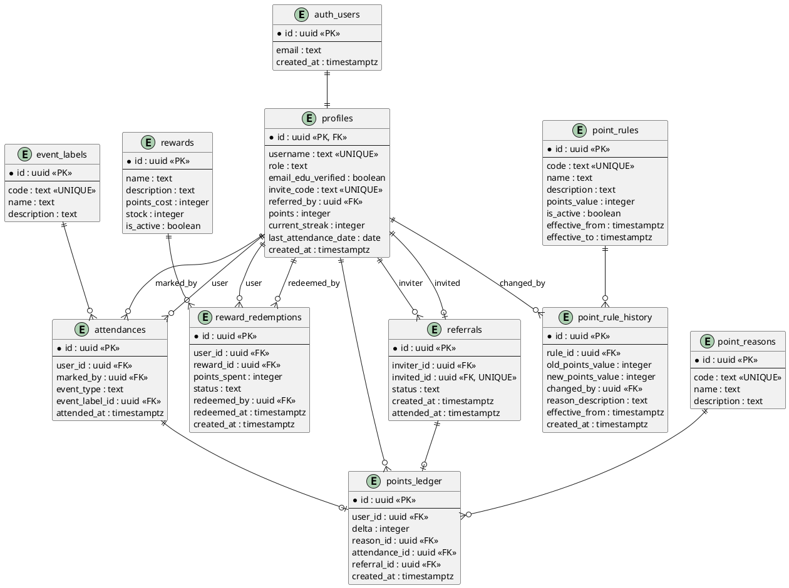
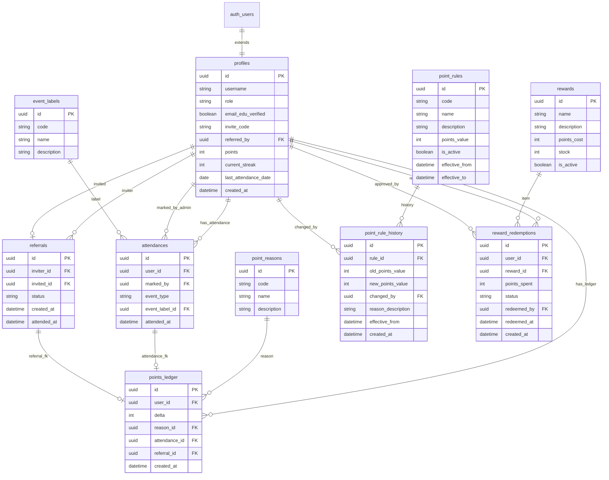

# Modelo de Datos — Portal de Fidelización Vinos del Corazón

## Diagramas del Esquema de Base de Datos

### Option 1: PlantUML ERD Diagram

---

### Option 2: Diagrama de Entidad-Relación (Mermaid Limpio)

---

## Descripción de Tablas

### 1. `profiles`
Extensión 1:1 de `auth.users`. Guarda metadatos de usuario, rol, código de invitación propio, conteo de racha actual y total acumulado de puntos.

### 2. `point_rules` & `point_rule_history` (Reglas y Kardex)
Permite configurar el valor en puntos de cada tipo de acción (`attendance`, `edu_bonus`, `referral_signup`, etc.) de forma dinámica con vigencia de fechas y auditoría de modificaciones de administrador.

### 3. `rewards` & `reward_redemptions` (Catálogo y Canjes)
Catálogo de premios disponibles (`rewards`) e historial de canjes validados por el administrador (`reward_redemptions`).

### 4. `attendances` & `event_labels`
Registro auditado de asistencias presenciales clasificadas según catálogos de eventos.

### 5. `points_ledger` & `point_reasons`
Fuente de verdad contable inmutable para todo incremento o descuento de puntos.
